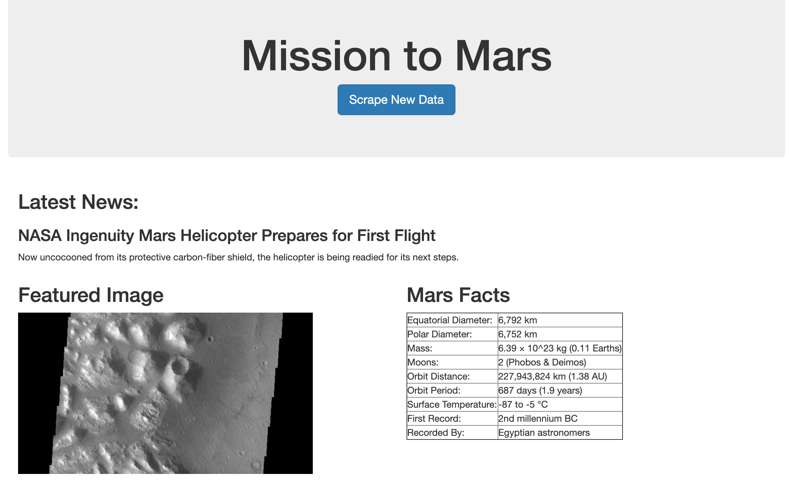
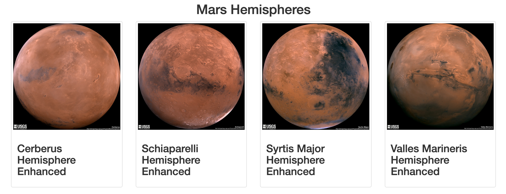

# mars-webscrape

## Tools
BeautifulSoup, Webdriver Manager, Splinter, Requests, Flask, Pandas, PyMongo.

## Summary

A web application that scrapes various websites for data related to the Mission to Mars and displays the information on a page with a button that allows users to run a new scrape. 

## Information collected 

* 'Latest News Title' and excerpt from the [NASA Mars News Site](https://mars.nasa.gov/news/).
* 'Featured Space Image' from [JPL Featured Space Image](https://data-class-jpl-space.s3.amazonaws.com/JPL_Space/index.html).
* 'Mars Facts' table from [Space Facts](https://space-facts.com/mars/)
* Images and titles of each of Mar's hemispheres from the [USGS Astrogeology site](https://astrogeology.usgs.gov/search/results?q=hemisphere+enhanced&k1=target&v1=Mars).

The information was scraped and added to a dictionary. 

## Flask app

Using Flask, the app route ('/scrape') calls the scrape function that collects the above information then updates/inserts the dictionary into a MongoDB database and redirects to the index. The index page locates and returns a template containing the scraped information. 

# Final webpage:

